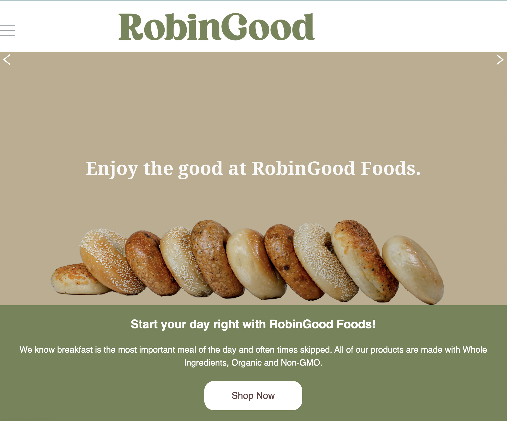

# RobinGoodFoods

## Badges
  

  ## Table of Contents
  * [License](#license)
  * [Description](#description)
  * [Installation](#Installation)
  * [Walk Through](#walkthrough)
  * [Heroku Link](#Herokulink)
  * [Usage](#usage)
  * [Questions](#questions)

  ## License
  Read more about ISC here:
  [ISC] (https://opensource.org/licenses/ISC)

  ## Description
Calling all breakfast lovers! We know breakfast is the most important meal of the day and often times skipped.  All of our products are made with Whole Ingredients, Organic and Non-GMO. Enjoy the good at RobinGood Foods.

  ## Installation

  ## Walk Through
[Walk Through](https://drive.google.com/file/d/1SXbhFMWqTGeBYvFLmwWgN-lM-iHJ45GT/view)

  ## Usage

  ## Presentation Link
[RobinGood Foods Presentation](https://docs.google.com/presentation/d/1YhERuZA8pJLMTRrxr1xVVFPwtm9rubfav2kxhWUqnsQ/edit#slide=id.g29f43f0a72_0_15)

  ## Heroku Link
 

  ## Questions?
  ### Reach me here: 
  * [claire-max](https://github.com/claire-max) 
  * [rimadas9878](https://github.com/rimadas9878)
  * [iTeak](https://github.com/iTeak)
  * [Everyone1138](https://github.com/Everyone1138)
  * [subie23](https://github.com/subie23)